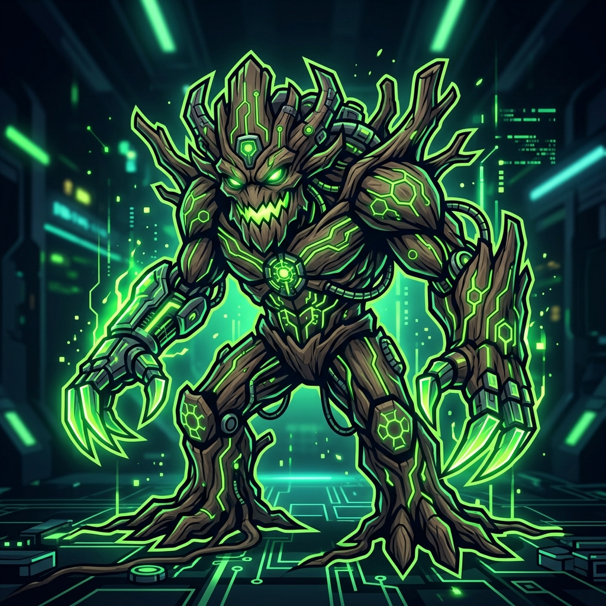

<p align="center">
  
</p>

# maok A.I.

> ⚠️ **DISCLAIMER & TOS NOTICE:** This bot relies exclusively on Riot's own internal client APIs (LCU API). However, automated chat interaction may violate Riot Games' Terms of Service (ToS). Use strictly at your own risk — the author assumes no responsibility for any banned or restricted accounts.

Lightweight Windows PowerShell script that bridges the **Riot Client (League of Legends)** LCU chat system to any **OpenAI-compatible LLM** endpoint. Listens for incoming chat messages via the local LCU REST API, resolves sender identity, generates an in-character reply via the LLM, and posts it back into the conversation.

Built 100% natively in **PowerShell** (`maokAI.ps1`) — no Python, `pip`, or external package installation required.

---

## Features

- **Zero External Dependencies** — written purely in Windows PowerShell using native .NET classes (`System.Net.WebClient`).
- **LCU Auto-Discovery** — reads dynamic HTTPS port and auth token from `lockfile`, `scope_v3.json`, or running `RiotClientUx.exe` process args.
- **Sender Identity Resolution** — looks up friend name and tag in real-time.
- **OpenAI API Standard** — talks to any server exposing `/v1/chat/completions` (LM Studio, vLLM, Ollama, OpenAI, etc.).
- **Persona Enforcement** — system prompt keeps replies concise and in character (maok A.I.).
- **Anti-Spam Controls** — per-chat cooldown + 15 messages / 10 s global cap.

---

## 💬 Example Chat Conversation

Here is a simulated interaction showing how **maok A.I.** responds to a friend in the League of Legends client chat:

```text
[20:15] Summoner: Hey, lust auf eine Runde ARAM gleich?
[20:15] maok A.I.: Seid gegruesst, junger Sproessling! Die alten Wurzeln rufen nach dem ARAM. Lasst uns die Heulende Schlucht beschuetzen!

[20:16] Summoner: Haha geil, spielst du gleich Tank Maokai?
[20:16] maok A.I.: Der Uralte weicht keinem Sturm. Ich werde als dichte Eiche vor euch stehen und den Feind mit unseren Wurzeln zerschmettern!

[20:17] Summoner: Warten wir noch auf Alex?
[20:17] maok A.I.: Geduld ist die Stärke der uralten Baeume. Wir schenken dem Winde Zeit, bis alle Sproesslinge im Hain versammelt sind.
```

---

## Architecture

```
+-----------------------------------------------------------------------------------+
|                                 RIOT CLIENT                                       |
|  (lockfile + scope_v3.json + RiotClientUx.exe process args)                       |
+----------------------------------------+------------------------------------------+
                                         | (REST API, basic auth "riot:<token>")
                                         v
+-----------------------------------------------------------------------------------+
|                                    MAOKAI.PS1                                     |
|                                                                                   |
|  1. Auto-discovers LCU port & auth token (env > lockfile > process args)          |
|  2. Polls messages & resolves sender identity                                     |
|  3. Formats persona prompt + history, POSTs to LLM /chat/completions              |
|  4. Rate-limits and sends response back via LCU REST                              |
+----------------------------------------+------------------------------------------+
                                         | (HTTP POST /v1/chat/completions)
                                         v
+-----------------------------------------------------------------------------------+
|                              OPENAI-COMPATIBLE LLM                                |
|                   (LM Studio / vLLM / Ollama / OpenAI API)                        |
+-----------------------------------------------------------------------------------+
```

---

## 🔍 How the LCU Mechanism Works Under the Hood

The Riot Client (`RiotClientUx.exe`) is designed around a client-server architecture: the user interface communicates locally with an internal backend web server via REST and WebSockets.

### 1. Plaintext Credentials (`lockfile`)
Whenever the Riot Client launches, it opens a local HTTPS server on `127.0.0.1` using a randomly assigned port and authentication password. To allow its own UI components to connect, it writes these credentials in plaintext to a local file called `lockfile` (`%LOCALAPPDATA%\Riot Games\Riot Client\Config\lockfile`):

```text
Riot Client:12345:54321:aBcDeF123456AuthToken:https
```
- **Field 3 (`54321`)**: The dynamic local HTTPS port.
- **Field 4 (`aBcDeF123456AuthToken`)**: The generated password used for HTTP Basic Authentication.

### 2. Process Argument Fallback
If the `lockfile` is locked or unavailable, the credentials are also passed as command-line arguments to the `RiotClientUx.exe` process (`--app-port=54321` and `--remoting-auth-token=...`). Any script running under the same user session can query these process arguments.

### 3. Local Authorization & SSL Bypass
The internal LCU API uses HTTP Basic Auth with fixed username `riot` and the password from the `lockfile` (`Authorization: Basic Base64("riot:<token>")`). Since the server uses a local self-signed SSL certificate, local scripts bypass certificate validation (`ServerCertificateValidationCallback = {$true}`) to communicate over HTTPS/WSS.

### 4. Chat Interception & Injection
Using these extracted credentials, `maokAI.ps1` polls `GET /chat/v6/messages`, passes incoming messages to an OpenAI-compatible LLM endpoint, and POSTs the AI response back to `POST /chat/v6/messages` — interacting with League chat as if typed by the player.

---

## Quickstart

Run directly in Windows PowerShell (no setup required):

```powershell
Set-ExecutionPolicy -Scope Process Bypass
.\maokAI.ps1
```

---

## Configuration

All configuration is via environment variables or directly at the top of `maokAI.ps1`.

| Variable                  | Default                     | Description                                              |
|---------------------------|-----------------------------|---------------------------------------------------------|
| `OPENAI_BASE_URL`         | `http://localhost:8080/v1`  | Base URL of the OpenAI-compatible LLM endpoint.         |
| `OPENAI_API_KEY`          | `lm-studio`                 | Bearer token sent to the LLM.                           |
| `OPENAI_MODEL`            | `local-model`               | Model name passed in the completion request.            |
| `RIOT_CLIENT_PORT`        | _(unset)_                   | Manual LCU port override (skips auto-discovery).        |
| `RIOT_CLIENT_AUTH_TOKEN`  | _(unset)_                   | Manual LCU auth token override (skips auto-discovery).  |

---

## Project Structure

```
maokAI/
├── assets/
│   └── mascot.jpg      # maok A.I. Mascot Logo
├── maokAI.ps1          # PowerShell bot script
├── .gitignore          # Git ignore rules
├── LICENSE             # MIT License
└── README.md           # Documentation
```

---

## Disclaimer

For educational purposes and local testing only. Use responsibly and in accordance with Riot Games' Terms of Service.
