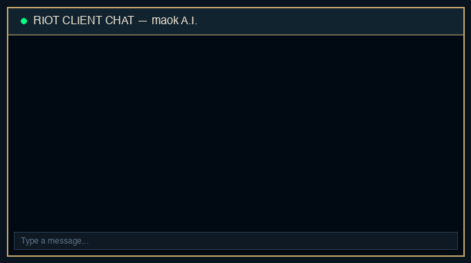

<p align="center">
  
</p>

# maok A.I. 🌳🤖

> ⚠️ **DISCLAIMER & TOS NOTICE:** This bot relies exclusively on Riot's own internal client APIs (LCU API). However, automated chat interaction may violate Riot Games' Terms of Service (ToS). Use strictly at your own risk — the author assumes no responsibility for any banned or restricted accounts.

Ever wondered what would happen if **Maokai, the Twisted Treant**, took over your League of Legends chat? 🌲

**maok A.I.** connects your local **Riot Client** to any AI model — including **LM Studio, Ollama, vLLM**, or the official **OpenAI API**. Whenever your League friends send you a chat message, **maok A.I.** intercepts it in real-time and responds directly as Maokai — wise, ancient, and protective of the forest!

Built 100% natively in **Windows PowerShell** (`maokAI.ps1`) — no Python, `pip`, or external package installation required!

---

## 🎬 Animated Chat Preview

<p align="center">
  
</p>

```text
[16:15] Summoner: Hey man! Down for an ARAM match right now?
[16:15] maok A.I.: Greetings, young sapling! The ancient roots call us to ARAM.

[16:16] Summoner: Awesome! Are you locking in Tank Maokai?
[16:16] maok A.I.: The tree does not bend! I shall shield our team like an iron oak.

[16:17] Summoner: Nice! Should we wait for Alex to join?
[16:17] maok A.I.: Patience is wisdom. We grant the wind time until all gather.
```

---

## 🚀 Features

- 🎮 **Made for League Players** — turns your League client chat into an in-character AI bot for your friends!
- ⚡ **Zero Setup & Dependencies** — runs natively in Windows PowerShell using built-in Windows .NET features.
- 🔍 **Automatic Client Detection** — automatically finds your running Riot Client, HTTPS port, and auth credentials.
- 🤖 **Universal OpenAI API Support** — works with local LLMs (LM Studio, Ollama) as well as the official **OpenAI API** (GPT-4o, GPT-4o-mini).
- 🛡️ **Anti-Spam & Rate Limits** — built-in cooldowns prevent spamming chat messages.

---

## ⚡ Quickstart

Run directly in Windows PowerShell (no installation required):

```powershell
Set-ExecutionPolicy -Scope Process Bypass
.\maokAI.ps1
```

---

## ⚙️ Configuration & LLM Providers

All settings can be configured via environment variables before launching `maokAI.ps1`, or edited directly at the top of the script.

| Variable                  | Default                     | Description                                              |
|---------------------------|-----------------------------|---------------------------------------------------------|
| `OPENAI_BASE_URL`         | `http://localhost:8080/v1`  | Base URL of the OpenAI-compatible LLM endpoint.         |
| `OPENAI_API_KEY`          | `lm-studio`                 | API key / Bearer token sent to the LLM endpoint.        |
| `OPENAI_MODEL`            | `local-model`               | Model ID requested (e.g. `gpt-4o-mini`, `local-model`). |
| `RIOT_CLIENT_PORT`        | _(unset)_                   | Manual LCU port override (skips auto-discovery).        |
| `RIOT_CLIENT_AUTH_TOKEN`  | _(unset)_                   | Manual LCU auth token override (skips auto-discovery).  |

### Option A: Local LLM (LM Studio / Ollama / LocalAI)
*Free, 100% private, and runs locally on your PC!*

```powershell
$env:OPENAI_BASE_URL="http://localhost:8080/v1"
$env:OPENAI_API_KEY="lm-studio"
$env:OPENAI_MODEL="local-model"
.\maokAI.ps1
```

### Option B: Official OpenAI API (GPT-4o / GPT-4o-mini)
*High-intelligence cloud responses directly from OpenAI!*

```powershell
$env:OPENAI_BASE_URL="https://api.openai.com/v1"
$env:OPENAI_API_KEY="sk-proj-your-actual-openai-api-key-here"
$env:OPENAI_MODEL="gpt-4o-mini"
.\maokAI.ps1
```

---

## 📐 Architecture

```
+-----------------------------------------------------------------------------------+
|                                 RIOT CLIENT                                       |
|  (lockfile + scope_v3.json + RiotClientUx.exe process args)                       |
+----------------------------------------+------------------------------------------+
                                         | (REST API, basic auth "riot:<token>")
                                         v
+-----------------------------------------------------------------------------------+
|                                    MAOKAI.PS1                                     |
|                                                                                   |
|  1. Auto-discovers LCU port & auth token (env > lockfile > process args)          |
|  2. Polls messages & resolves sender identity                                     |
|  3. Formats persona prompt + history, POSTs to LLM /chat/completions              |
|  4. Rate-limits and sends response back via LCU REST                              |
+----------------------------------------+------------------------------------------+
                                         | (HTTP POST /v1/chat/completions)
                                         v
+-----------------------------------------------------------------------------------+
|                              OPENAI-COMPATIBLE LLM                                |
|        (Local: LM Studio / Ollama  OR  Cloud: Official OpenAI API)                |
+-----------------------------------------------------------------------------------+
```

---

## 🔍 How the LCU Mechanism Works Under the Hood

The Riot Client (`RiotClientUx.exe`) is designed around a client-server architecture: the user interface communicates locally with an internal backend web server via REST and WebSockets.

### 1. Plaintext Credentials (`lockfile`)
Whenever the Riot Client launches, it opens a local HTTPS server on `127.0.0.1` using a randomly assigned port and authentication password. To allow its own UI components to connect, it writes these credentials in plaintext to a local file called `lockfile` (`%LOCALAPPDATA%\Riot Games\Riot Client\Config\lockfile`):

```text
Riot Client:12345:54321:aBcDeF123456AuthToken:https
```
- **Field 3 (`54321`)**: The dynamic local HTTPS port.
- **Field 4 (`aBcDeF123456AuthToken`)**: The generated password used for HTTP Basic Authentication.

### 2. Process Argument Fallback
If the `lockfile` is locked or unavailable, the credentials are also passed as command-line arguments to the `RiotClientUx.exe` process (`--app-port=54321` and `--remoting-auth-token=...`). Any script running under the same user session can query these process arguments.

### 3. Local Authorization & SSL Bypass
The internal LCU API uses HTTP Basic Auth with fixed username `riot` and the password from the `lockfile` (`Authorization: Basic Base64("riot:<token>")`). Since the server uses a local self-signed SSL certificate, local scripts bypass certificate validation (`ServerCertificateValidationCallback = {$true}`) to communicate over HTTPS/WSS.

### 4. Chat Interception & Injection
Using these extracted credentials, `maokAI.ps1` polls `GET /chat/v6/messages`, passes incoming messages to an OpenAI-compatible LLM endpoint, and POSTs the AI response back to `POST /chat/v6/messages` — interacting with League chat as if typed by the player.

---

## 📁 Project Structure

```
maokAI/
├── assets/
│   ├── chat_demo.gif   # Animated Riot Client Chat Preview
│   └── mascot.jpg      # maok A.I. Mascot Logo
├── maokAI.ps1          # PowerShell bot script
├── .gitignore          # Git ignore rules
├── LICENSE             # MIT License
└── README.md           # Documentation
```

---

## ⚖️ Disclaimer

For educational purposes and local testing only. Use responsibly and in accordance with Riot Games' Terms of Service.
